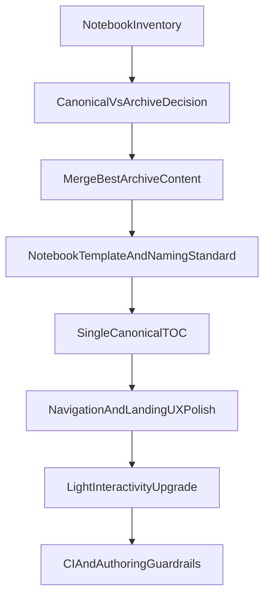

# Intermediate Macro Dashboard Revamp Plan

> Saved for later implementation (2026-05-27).  
> Decisions: Jupyter Book + light interactivity; merge best archive content into canonical notebooks; first pass = IA/UX + cleanup (not full content rewrite).

## Target Outcome

Build a cleaner, student-first Jupyter Book experience that keeps every current model available while making discovery, progression, and interactivity intuitive.

**Chosen direction:**

- Platform: Jupyter Book with stronger interactivity (Thebe/widgets/JupyterLite-friendly choices)
- Archive strategy: merge best archive material into canonical notebooks
- First pass scope: information architecture + UX + notebook cleanup + light interactivity

## Current-State Issues To Resolve

- Canonical navigation is fragmented across [`_toc.yml`](../../_toc.yml), [`_toc_full.yml`](../../_toc_full.yml), and [`_toc_simple.yml`](../../_toc_simple.yml).
- Landing and intro duplication across [`content/Preliminaries.ipynb`](../../content/Preliminaries.ipynb), [`content/Preliminaries_new.ipynb`](../../content/Preliminaries_new.ipynb), and [`content/Preliminaries_clean.ipynb`](../../content/Preliminaries_clean.ipynb).
- Archival overlap in [`content/_archive/`](../../content/_archive/) creates uncertainty on what is canonical.
- Build/deployment baseline exists but maintainability guardrails are missing ([`.github/workflows/deploy.yml`](../../.github/workflows/deploy.yml), [`requirements.txt`](../../requirements.txt)).

## Proposed Information Architecture

Use a single canonical TOC and organize all model pages into clear learning tracks:

- Foundations and Setup
- Measurement and National Accounts
- Growth and Long Run Dynamics
- Intertemporal Choice and Labor
- Business Cycles and Policy Dynamics

Keep one canonical notebook per model topic in active navigation; preserve prior versions under archive with provenance notes.

## Execution Phases

### Phase 0: Baseline Inventory and Canonical Mapping

- Build a model inventory document (`model_id`, canonical notebook, archive sources, merge status).
- Confirm one active version per model currently listed in [`_toc_full.yml`](../../_toc_full.yml).
- Mark archive notebooks in [`content/_archive/`](../../content/_archive/) as:
  - merge-required
  - keep-as-historical
  - superseded

**Deliverable:** New manifest doc (for example `content/MODELS.md`) with canonical mapping and merge queue.

### Phase 1: Navigation and Dashboard Foundation

- Promote one canonical table of contents in [`_toc.yml`](../../_toc.yml) using part-based sections.
- Align root entrypoint with a single intro notebook (likely [`content/Preliminaries_new.ipynb`](../../content/Preliminaries_new.ipynb) after cleanup).
- Reduce manual link overload in intro notebook; rely on sidebar progression and concise dashboard-style section cards.
- Keep [`_toc_full.yml`](../../_toc_full.yml) and [`_toc_simple.yml`](../../_toc_simple.yml) only if needed as generated/maintenance artifacts; otherwise deprecate.

**Deliverable:** Students can navigate all canonical models via sidebar + previous/next without needing manual index hunting.

### Phase 2: Canonical Notebook Consolidation

- For each topic with overlap, merge high-value archive content into canonical notebook, then annotate archive notebook as historical source.
- Prioritize high-confusion clusters first:
  - Intro variants (`Preliminaries*`)
  - Two-period cluster (`2_period_consump`, `two_period_model`, backup variant)
  - AD-AS cluster (`adas_model`, `adassim`, `dynamicshock`)
  - Growth legacy variants in archive
- Standardize notebook structure:
  - Learning goals
  - Core intuition and equations
  - Visual/interactive block
  - Economic interpretation
  - Quick self-check questions

**Deliverable:** Canonical notebooks are richer and consistent while archives remain preserved.

### Phase 3: Light Interactivity Upgrade

- Add/normalize low-friction interactive elements already supported by project dependencies (`ipywidgets`, `plotly`, `bqplot` where useful).
- Ensure each major model has at least one “parameter play” cell with clear instructions.
- Keep execution mode compatible with current build constraints in [`_config.yml`](../../_config.yml) (`execute_notebooks: off`), while ensuring committed outputs remain clean and readable.
- Validate Thebe usage quality rather than adding interactivity everywhere.

**Deliverable:** Every core model has at least one intuitive, student-usable interactive element.

### Phase 4: Maintainability and Contributor UX

- Add repository hygiene and contribution guidance:
  - root README for purpose, local run, build/deploy flow
  - contributor notes for adding/updating a model notebook
- Add/strengthen authoring guardrails:
  - notebook cleanliness policy (output handling, metadata consistency)
  - TOC-manifest consistency check in CI
- Review [`.github/workflows/deploy.yml`](../../.github/workflows/deploy.yml) for dead/contradictory steps and simplify preview/deploy logic.

**Deliverable:** Future updates stay coherent without reintroducing bulk/non-intuitive structure.

## Success Criteria

- All currently present models remain available in the final build.
- One canonical navigation path exposes all active model pages.
- Intro/dashboard page is concise and guides students to modules quickly.
- Archive content is preserved, with best ideas merged into canonical pages.
- Students can run or inspect at least one interactive element per core module without setup confusion.

## Recommended Build Sequence

1. Inventory + canonical mapping
2. TOC unification and intro cleanup
3. Archive merge wave by wave
4. Interactivity pass on canonical notebooks
5. CI/README/maintenance hardening

## Implementation Checklist

- [ ] Create canonical model inventory and archive merge map from all current notebooks
- [ ] Replace fragmented TOC setup with one canonical part-based `_toc.yml`
- [ ] Consolidate Preliminaries variants into one dashboard-style landing notebook
- [ ] Merge high-value archive material into canonical notebooks while preserving originals
- [ ] Apply consistent notebook pedagogical template across canonical models
- [ ] Add one clear interactive parameter-play block to each core module
- [ ] Add README/contributor guidance and CI checks for TOC-manifest consistency
- [ ] Run end-to-end navigation and usability validation for a first-time student journey
